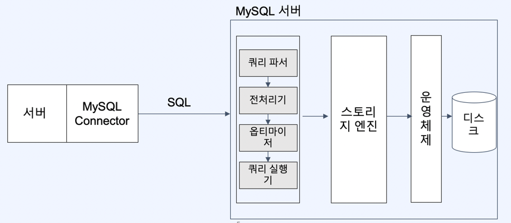
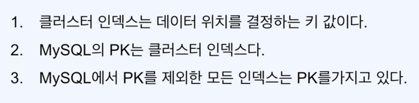

# 왜 Mysql 인가 ?
## 1. 여전히 사용량이 높은 RDB

DB 엔진 랭킹 사이트 : https://db-engines.com/en/ranking

위사이트를 보면 1~4 위는 여전히 RDB 인것을 확인할 수 있다 
하지만 RDB 뿐 아니라 다른 종류의 데이터베이스도 또한 알야한다 

Mysql 은 RDB 중에서 가장 인기가 많은 오픈소스 관계형 데이터 베이스이다 
뿐만 아니라 국내외 대기업 IT 회사에서 가장 많이 사용된다 

공식 홈페이지 : 
http://github.com/mysql/mysql-server 
https://dev.mysql.com/doc/internals/en/guided-tour.html 
https://dev.mysql.com/doc/dev/mysql-server/latest/ 

## 2. Mysql 아키텍처

서버로부터 요청은 Mysql 엔진, 스토리지 엔진, 운영체제를 통해 디스크에 접근하여 데이터를 서버에 전달하게 된다 
Mysql 엔진은 사람으로 치면 두뇌, 스토리지 엔진은 동작을 수행하는 팔과 다리라고 생각하면 된다 
Mysql 엔진은 접속을 처리하는 커넥션 핸들러. 쿼리파서, 전처리기, 옵티마이저, 쿼리실행기 등의 구성요소가 존재한다 

### MYSQL 엔진
- 쿼리파서
  - SQL 을 파싱하여 Syntax Tree 를 만듬
  - 이과정에서 SQL 문법검사가 이루어짐
- 전처리기
  - 쿼리파서에서 만든 Tree 를 바탕으로 전처리 시작
  - 테이블이나 컬럼 존재여부, 접근권한등 Semantic 오류 검사
  - 쿼리파서, 전처리기는 컴파일 과정과 매우 유사하지만 SQL 은 프로그래밍처럼 컴파일 타임에서 검사할수 없어 매번 구문평가를 진행한다
- 옵티마이저
  - 쿼리를 처리하기위한 여러가지 방법을 만들고, 각 방법들의 비용정보와 테이블의 통계정보를 이용하여 비용을 산정
  - 테이블 순서, 불필요한 조건 제거, 통계정보를 바탕으로 전략을 결정한다 (**실행계획 수립**)
  - 옵티마이저가 선택하는 전략에따라 성능이 많이 달라진다 EXPLAIN 을 통해 옵티마이저가 어떤 결정을 했는지 개발자가 확인할 수 있다
- 쿼리실행기
  - 옵티마이저가 결정한 실행계획을 스토리지 엔진에 Handler API 를 통해 전달한다

> 쿼리캐시

쿼리캐시란 SQL 의 실행결과를 메모리에 캐시하고, 동일 SQL 쿼리가 실행되면 테이블을 읽지 않고 즉시 결과를 반환하기 때문에 빠른 성능을 보였다 
Mysql 5 버전까지는 쿼리캐시 기능을 제공하였지만 Mysql 8 버전에서는 해당 기능이 삭제되었다 

이유는 테이블 데이터가 변경되면 캐시되어있는 데이터도 함꼐 변경되어야하는데 캐시, 스토리지 상의 동기화시 많은 이슈가 발생하였기 때문이다 
 
Oracle 에 쿼리캐시와 비슷한 개념이 존재한다
- 소프트 파싱
  - SQL 실행계획을 캐시에서 찾아 옵티마이저 과정을 생략하고 실행단계로 넘어감
- 하드 파싱
  - 옵티마이저 과정을 생략하지않고 실행단계로 넘어감

Mysql 은 실행결과를 캐싱하는 쿼리캐싱, Oracle 은 실행계획을 캐싱하는 소프트 파싱을 제공한다
두 RDB 의 캐시 전략은 범위가 다르다는 점이 있다

하지만 캐시도입은 만료정책을 고려해야한다

쿼리캐시는 소프트캐시에 비해 조회성능은 높지만 캐시데이터에대한 관리(동기화) 비용이 많이 소모된다  
소프트파싱은 쓰기 전략에 높은 성능을 제공한다

### 스토리지 엔진

디스크에서 데이터를 가져오거나 저장하는 역할을 수행한다  
MYSQL 8 버전부터 InnoDB 엔진을 디폴트로 사용한다

InnoDB 의 핵심 키워드는 (인덱스 part) Clustered Index / (트랜젝션 part) Redo-Undo, Buffer pool  

## 3. 정규화 - 비정규화
데이터베이스 정규화 참고 : https://mangkyu.tistory.com/110  

- 정규화
  - 정규화란 결국 데이터 중복을 최소화시키는게 궁극적인 목표이다
  - 책을 쓰는 작가라고 생각해보면 주인공이름을 읽을때 한곳에서 관리한다면 추후 수정에 용이할 것이다
  - 데이터 조회에는 장점이 있지만 쓰기 관점에선 원본데이터를 참조해야한다는 점에서 단점이 있다
- 비정규화
  - 읽기의 성능을 올리기 위해 중복을 허용하는 것을 말한다
  - 데이터 조회에는 단점이 있지만 쓰기 관점에서는 장점이 있다

**결국 읽기와 쓰기사이의 트레이드오프를 고민하는것**  

### 중복된 데이터라면 반드시 정규화를 해야하는가 ?
- 정규화도 일종의 비용이다. (읽기 비용을 지불하고 쓰기 비용을 줄이는것)

### 정규화시 고려해야 하는것
- 얼마나 빠르게 데이터의 최신성을 보장해야하는가 ?
- 히스토리성 데이터는 오히려 정규화의 필요성이 떨어진다
- 데이터 변경 주기는 어떻게 되는가 ?
- 객체 (테이블) 탐색 깊이가 얼마나 깊은

### 정규화를 하기로 했다면 데이터를 어떻게 가져올 것인가 ?
- 보통 테이블 조인을 바로 생각하는데 이는 고민해볼 문제이다
  - 테이블 조인은 서로 다른 테이블의 결합도를 높히는 것이다
- 조회시엔 성능이 좋은 In memory DB 같은 캐싱과 별도 DB 를 이용하는 방법이 있다
- 읽기쿼리가 한번더 발생하는 것은 그렇게 큰 부담이 아닐 수 있다  

## 4. 인덱스

### 데이터베이스 성능의 핵심
- 메모리 : 저장속도 빠름, 휘발성 데이터, 비싼 비용
- 디스크 : 저장속도 느림, 영속성 데이터, 저렴한 비용
- 데이터베이스는 결국 데이터를 디스크에 저장해야한다 
- 실제로 데이터베이스에 데이터를 저장시 메모리와 디스크 모두 사용한다
- 이때 메모리 데이터의 데이터 유실을 방지하기위해 WAL(Write Ahead Log) 이라는 기술을 활용한다
- 대부분의 트랜잭션은 랜덤하게 I/O 가 발생하는데 이를 지연시켜 순차적 I/O 를 발생시켜 정합성을 유지한다
- **결국 데이터베이스 성능의 핵심은 디스크의 랜덤 I/O 를 최소화 하는것**

### 인덱스의 기본동작
- 인덱스는 정렬된 자료구조, 이를 통한 탐색범위를 최소화 하는것
- 인덱스는 일종의 테이블이다

인덱스에 사용되는 적합한 자료구조
1. HashMap
- 단건 검색 : O(1)
- 범위 검색 : O(N)
- 전방 일치검색 불가 (like 'AB%') 
2. List
- 정렬되지 않는 리스트 탐색 : O(N)
- 정렬된 리스트 탐색 : O(logN) - 이진탐색
- 정렬되지 않는 리스트 정렬 : O(N) ~ O(N * logN)
- 삽입 / 삭제 에대한 비용이 매우 높음
3. Tree
- 이진탐색을 하는 가정하에 트리 높이에 따라 정렬속도가 결정되어 트리높이를 최소화하는것이 필요하다
- 한쪽 노드로 치우져지지 않게 데이터를 쌓는게 중요하다 (Red-black Tree, B+ Tree)
4. B+ Tree
- 삽입, 삭제시 균형을 이룬다
- 하나의 노드가 여러개의 자식노드를 가질 수 있다
- 리프노드에만 데이터가 존재하며 나머지 노드들은 데이터를 찾기위한 키만 존재한 (연속된 데이터 접근에 유리)
- Mysql 의 장점으로 리프노드에 데이터의 Key 값으로 PK (Cluster Index) 를 담고있
- 결국 인덱스를 사용하는건 조회의 성능에 이점을 가져가지만 쓰기성능에 저하를 발생하므로 적절한 고려가 필요하다

### 클러스터 인덱스

mysql 의 PK 로 2가지 방법이 존재한다
- Auto Increment
  - 장점 : 
    - 정수기반의 메모리 저장 공간 사용량이 효율적이다
    - 연속적으로 증가하는 숫자로 B+ tree 인덱스 자료구조에 적합하다
    - 인덱스가 정렬된 상태를 유지하므로 삽입 I/O 에 유리하다
  - 단점 :
    - 여러 데이터베이스 인스턴스 간의 데이터 동기화나 분산 시스템에서 활용할 경우 기본키 충돌이 발생할 수 있다
    - 데이터 삭제후 재 삽입 시 중복된 키를 피하기 위해 auto increment 값을 변경해야한다
- UUID
  - 장점 : 
    - 글로벌 고유성을 가지고 있어 여러 데이터베이스 인스턴스나 분산 시스템에서 활용하기 용이하다
    - 중앙 집중형 ID 생성이 아니므로 여러 노드에서 동시에 생성이 가능하여 마이크로 서비스나 다중 데이터베이스 아키텍쳐에 유리하다
    - 데이터 마이그레이션시 고유성이 보장되어 용이하다
  - 단점 : 
    - auto increment 보다 크기를 많이 소요하며 인덱스 생성비용이 높다
    - UUID 는 랜덤하게 생성되어 인덱스가 비 순차적으로 생성되어 디스크 I/O 와 읽기 성능에 저하를 발생할 수 있다

### 조회 최적화를 위한 인덱스 이해하기
- 인덱스 필드 가공
  - 인덱스 필드를 가공하게 되면 인덱스를 탈수 없게된다
  - (ex. PK 값에 사칙연산을 사용, 숫자형 PK 에 '' 문자열로 조회)
- 복합 인덱스
  - 복합 인덱스를 설정할때는 선두 컬럼을 중요하게 정해야한다 (성별과 같은 분포도가 높은 컬럼이 아닌, 분포도가 낮은 컬럼들을 설정한다)
  - A, B 컬럼 복합 인덱스를 건 경우 B 만 where 절로 조회했을때 인덱스를 타지 않는다.
- 하나의 쿼리에는 하나의 인덱스만
- where, order by, group by 를 잘 혼합해서 인덱스를 사용해야한다

**하지만**
- explain 으로 쿼리를 확인할 수 있지만 dev, prod 환경에따라 데이터가 다르게 적재되므로 인덱스가 의도치않게 동작할 수 있음
- 인덱스도 비용이다. 쓰기를 희생하고 조회를 얻는것
- 꼭 인덱스로만 해결할 문제인가 ? (ex. CQRS 패턴, 캐시사용)
- 인덱스로 설정되는 컬럼은 cardinality (선택도) 가 높은 값으로 정하는게 이점이 많다

## 5. 페이지네이션